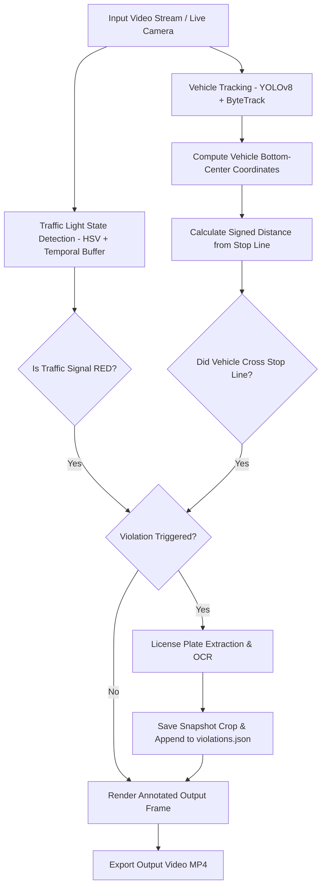

# 🚦 Traffic Signal Violation Detection System

An end-to-end computer vision and deep learning system built with **YOLOv8** and **ByteTrack** for real-time red-light traffic signal violation detection, vehicle tracking, stop-line crossing verification, and automatic license plate recognition (ALPR).

---

## 📌 Features

- **Automated Vehicle Detection & Tracking**: Leverages fine-tuned YOLOv8 (`best.pt`) combined with **ByteTrack** for continuous multi-object tracking across video streams.
- **Traffic Light State Classification**: Real-time HSV color segmentation with temporal smoothing to accurately detect Red, Yellow, and Green signal states.
- **Robust Stop-Line Crossing Geometry**: Computes signed perpendicular distances from defined stop-lines, enforcing motion direction and jump filtering to avoid false positives.
- **Automatic License Plate Recognition (ALPR)**: Perspective correction, CLAHE image enhancement, and OCR extraction on violating vehicles.
- **Structured Violation Logging**: Automatically generates structured JSON logs (`violations.json`) and exports frame snapshot crops of all flagged violations.
- **Interactive ROI & Line Calibration Tool**: Built-in utility to map Stop Line coordinates and Traffic Light ROIs on any camera feed or video file.

---

## 📁 Repository Structure

```text
traffic-violation-system/
├── config.yaml                   # Global pipeline configuration (ROIs, thresholds, model paths)
├── main.py                       # Main CLI entrypoint to process videos / live camera streams
├── best.pt                       # Trained YOLOv8 model weights
├── last.pt                       # Training checkpoint weights
├── violations.json               # Structured JSON log of recorded violations
├── requirements.txt              # Project Python dependencies
├── README.md                     # Complete system documentation
│
├── src/                          # Core Modular Pipeline Package
│   ├── __init__.py
│   ├── detector.py               # YOLOv8 object detector & ByteTrack tracker wrapper
│   ├── signal_classifier.py      # HSV traffic light color state classifier with temporal smoothing
│   ├── line_detector.py          # Line geometry, signed distance & crossing logic
│   ├── plate_recognizer.py       # License plate crop, perspective correction & OCR engine
│   └── logger.py                 # Structured JSON & snapshot image logger
│
├── utils/                        # Visualization & Calibration Utilities
│   ├── __init__.py
│   ├── draw_utils.py             # Rendering bounding boxes, signal badges, and violation banners
│   └── calibration_tool.py       # Grid overlay tool to measure ROI & line coordinates
│
└── notebooks/                    # Archived Jupyter Training & Experimentation Notebooks
    ├── final_trafficviolationsystem.ipynb
    ├── full-pipeline-signal.ipynb
    ├── plate-recognition.ipynb
    ├── signal-violation-system.ipynb
    ├── signal-violation.ipynb
    ├── vehicle-tracking.ipynb
    └── vehicledetectionfinal.ipynb
```

---

## 🔄 System Architecture & Pipeline Workflow



1. **Traffic Light State Classifier (`signal_classifier.py`)**:
   - Isolates the Traffic Light Region of Interest (ROI).
   - Segments color space using HSV bounds for Red, Yellow, and Green.
   - Maintains a sliding window buffer (`min_red_frames` out of `signal_history_len`) to prevent signal flicker errors.

2. **Stop-Line Crossing Verification (`line_detector.py`)**:
   - Calculates the signed perpendicular distance $d$ of a vehicle's bottom-center point $(x, y_{bottom})$ relative to the line $P_1(x_1, y_1) \rightarrow P_2(x_2, y_2)$:
     $$d = y_{bottom} - \left[ y_1 + (y_2 - y_1) \cdot \frac{x_{bottom} - x_1}{x_2 - x_1} \right]$$
   - A violation is confirmed **only** if:
     - Vehicle was previously behind the stop line ($d_{prev} \le -\text{margin}$).
     - Vehicle is currently past the stop line ($d_{curr} \ge \text{margin}$).
     - Direction vector indicates forward downward motion.
     - Frame-to-frame jump distance is physically reasonable ($\Delta d \le \text{max\_jump}$).
     - Signal at the crossing moment was confirmed **RED**.

3. **License Plate Recognition (`plate_recognizer.py`)**:
   - Crops vehicle bounding box.
   - Applies min-area bounding box perspective warping to straighten angled plates.
   - Applies CLAHE contrast enhancement and non-local means denoising.
   - Passes clean crop to OCR reader.

---

## ⚡ Quickstart & Installation

### 1. Prerequisites
- Python 3.9+ 
- PyTorch 2.0+
- OpenCV 4.8+
- CUDA-compatible GPU (Recommended for high-FPS processing)

### 2. Installation Setup

Clone the repository and set up a virtual environment:

```bash
# Clone repository
git clone https://github.com/Nadantikaa/traffic-violation-model.git
cd traffic-violation-model

# Create virtual environment
python -m venv venv

# Activate environment (Windows)
.\venv\Scripts\activate
# Activate environment (Linux/macOS)
source venv/bin/activate

# Install dependencies
pip install -r requirements.txt
```

---

## 🚀 How to Run the Pipeline with `best.pt`

### 1. Process Video File
Run the complete pipeline on a video using the trained `best.pt` model weights:

```bash
python main.py --video path/to/your/traffic_video.mp4
```

### 2. Headless Mode (No Display Window)
For server or automated batch execution, disable the OpenCV preview window:

```bash
python main.py --video path/to/your/traffic_video.mp4 --no-display
```

### 3. Run on Live Webcam Feed
Pass `0` to process a connected camera device:

```bash
python main.py --video 0
```

---

## ⚙️ Calibration Guide (`config.yaml`)

To adapt the pipeline to a new camera setup or video angle, update the coordinates in `config.yaml`.

### Step 1: Run the Calibration Grid Tool
Generate a frame with coordinate grid ticks:

```bash
python utils/calibration_tool.py path/to/your/traffic_video.mp4
```
This saves `calibration_grid_frame_100.jpg`. Open the image to note down X and Y coordinates.

### Step 2: Edit `config.yaml`

```yaml
models:
  vehicle_model: "best.pt"         # Path to trained YOLOv8 model
  confidence: 0.25                 # Detection confidence
  imgsz: 1280                      # High-res inference size

signal_calibration:
  # Traffic light ROI: [x1, y1, x2, y2]
  traffic_light_roi: [1750, 35, 1850, 300]
  
  # Stop line points: [[start_x, start_y], [end_x, end_y]]
  stop_line: [[0, 800], [1900, 860]]
  
violation_rules:
  min_track_frames: 5              # Minimum tracking frames before check
  pre_cross_margin: 5              # Required distance behind line before crossing
  post_cross_margin: 0
  max_crossing_jump: 120           # Filter detection jumps

output:
  output_json: "violations.json"
  output_video: "output_tracked.mp4"
  save_snapshots: true
  snapshot_dir: "violations_snapshots"
```

---

## 📊 Structured JSON Output Format (`violations.json`)

When a vehicle commits a red-light violation, a structured record is appended to `violations.json`:

```json
[
  {
    "violation_id": 1,
    "timestamp": "2026-10-04T12:00:00.123456",
    "frame_number": 312,
    "vehicle_track_id": 14,
    "vehicle_class": "car",
    "bbox": [850, 720, 1100, 910],
    "signal_state": "RED",
    "license_plate": "MH12DE1432",
    "plate_confidence": 0.92,
    "snapshot": "violations_snapshots/violation_track_14_frame_312.jpg"
  }
]
```

---

## 💻 Python API Usage Example

You can also import system modules directly into custom Python applications (Flask, FastAPI, Streamlit):

```python
import cv2
from src import TrafficLightClassifier, LineCrossingDetector, VehicleTracker, PlateRecognizer

# Initialize components
tracker = VehicleTracker(model_path="best.pt", conf=0.25)
classifier = TrafficLightClassifier(roi=(1750, 35, 1850, 300))
line_detector = LineCrossingDetector(stop_line=((0, 800), (1900, 860)))
plate_ocr = PlateRecognizer()

# Process frame
frame = cv2.imread("sample_frame.jpg")
signal_state, r, y, g = classifier.detect_state(frame)

print(f"Traffic Signal State: {signal_state}")
```

---

## 🤝 Contributing & License

Contributions are welcome! Please open an issue or pull request for features, bug fixes, or enhancements.

Distributed under the MIT License.
